### Web based library application created using PHP and MySQL


To import the database you need to chage the *input file size limit* 
```
(in XAMPP on apache click config-> file to do that is-> (PHP.ini-> post_max_filesize nad-> upload_max_filesize)) 
```

##### DATABASE SIZE IS 148MB 
```
Also you need to disable or make longer the execution time limit in PHPMyAdmin. I recommend setting the walue to 0
```

##### Project has 3 roles

* User/Renter
* Librarian/Worker
* Admin


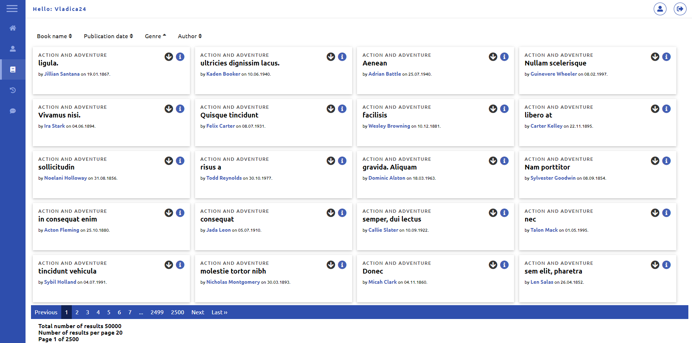
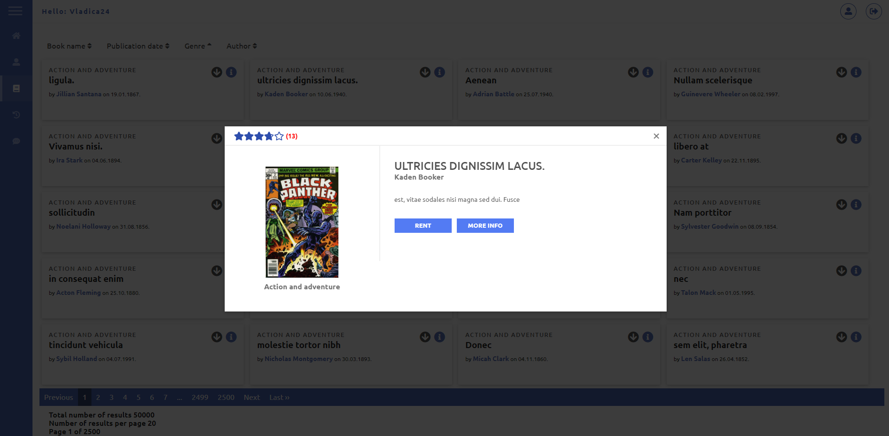
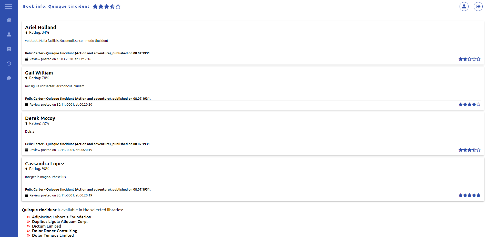

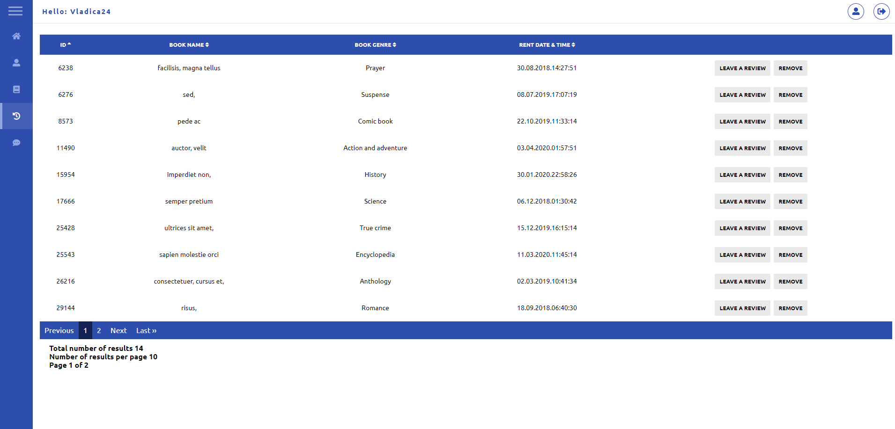
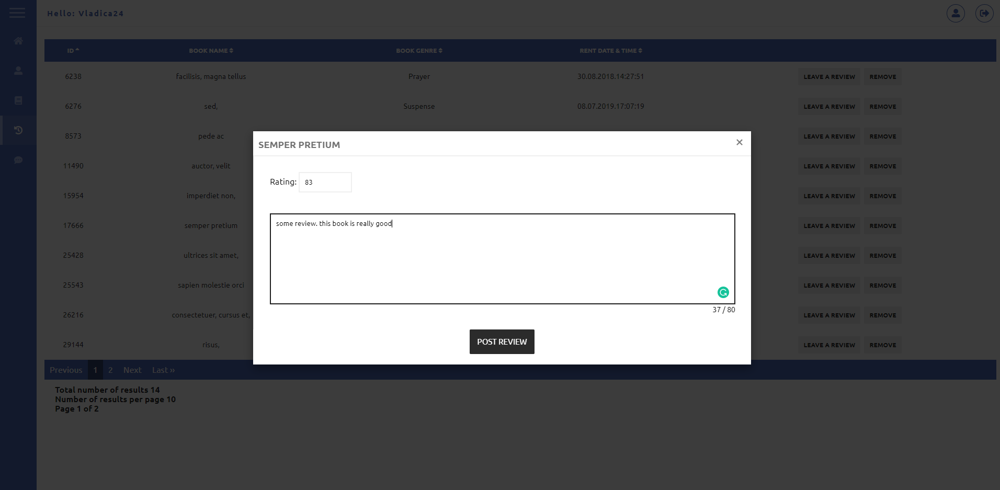
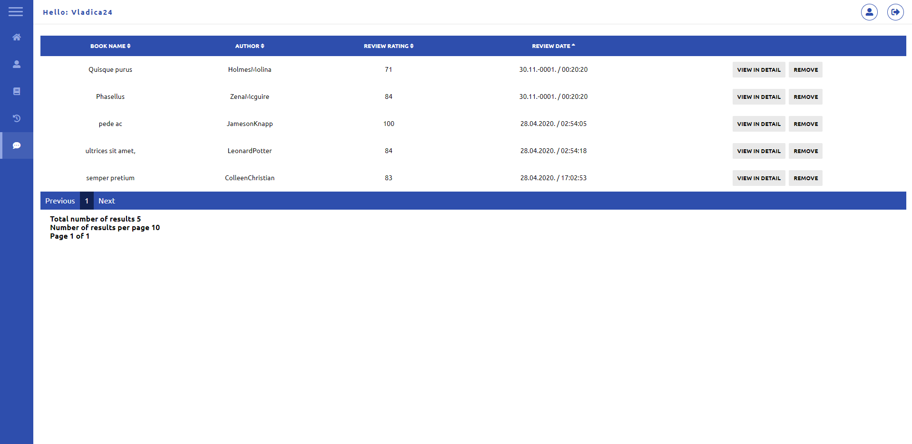
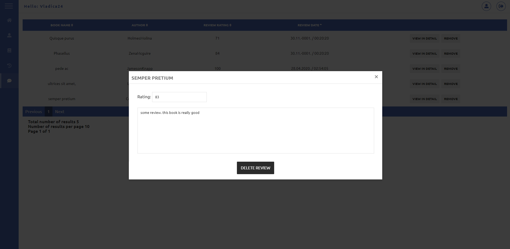
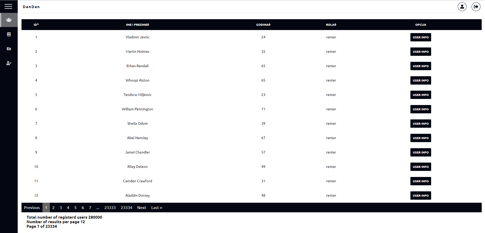
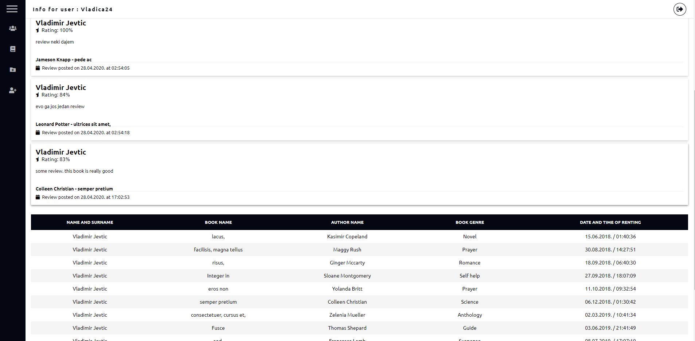
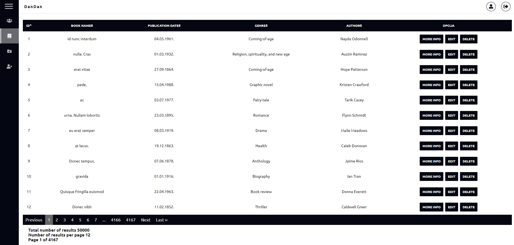
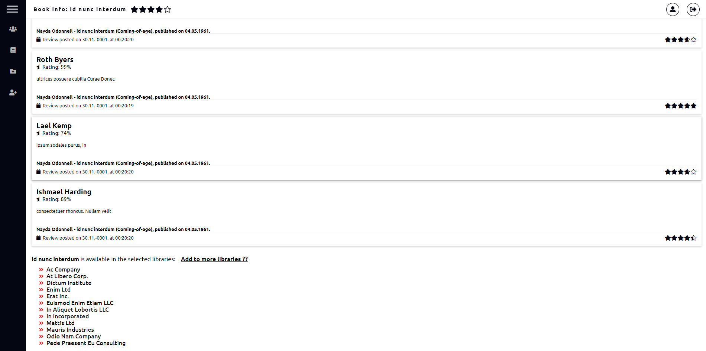
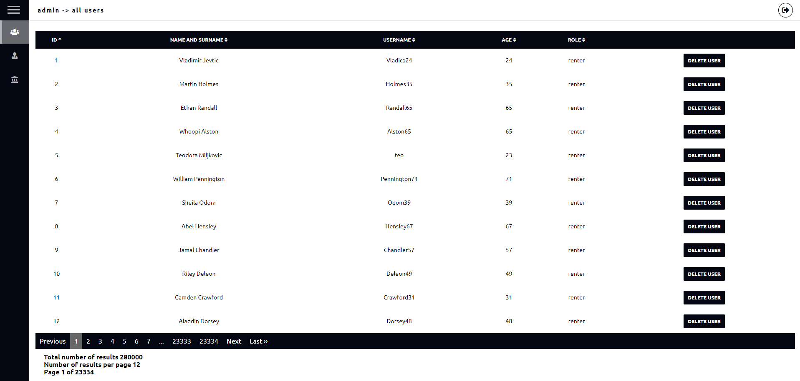
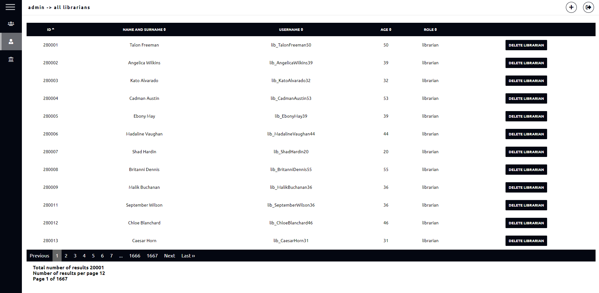
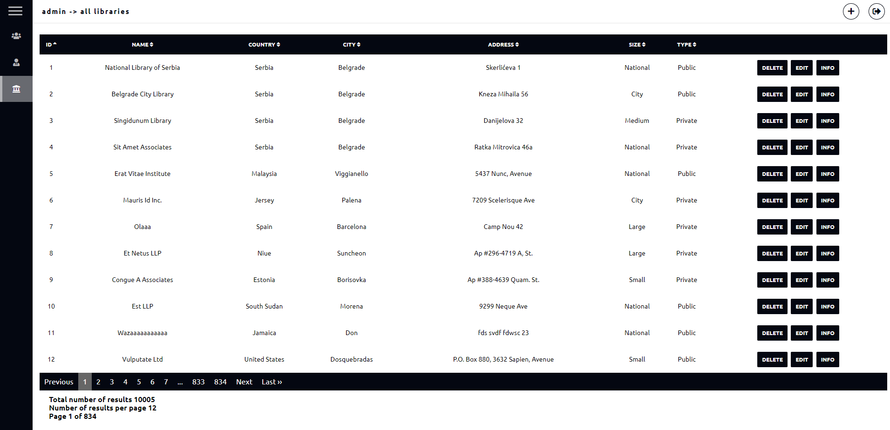

